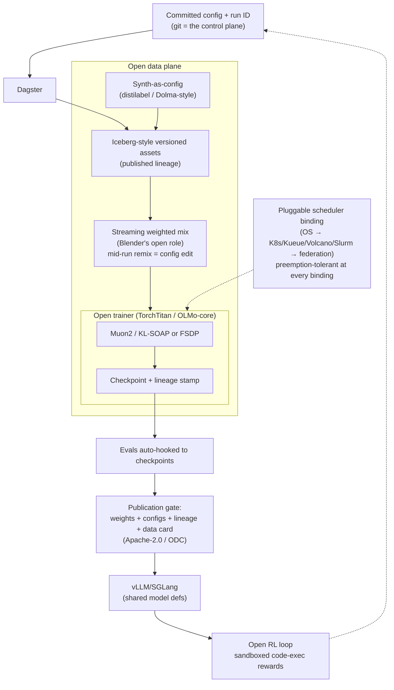

# Open Model Factory — Design Sketch

> Draft outline for an open-source, community-owned counterpart to the Poolside
> Model Factory (`method:poolside-model-factory`). The Poolside factory is the
> date-stamped process SOTA (Laguna M.1/XS.2, arXiv:2605.27605) but its
> internals are closed; this sketch defines what an open re-implementation
> looks like for labs that cannot use (or audit) a closed, owned stack.
>
> Status: **sketch, not SOTA.** Nothing here is benchmark-verified yet. This
> document is not a graph node; ingestion into `graph/` happens only after a
> public run demonstrates the claims below.

## 1. Positioning

The Poolside Model Factory is process SOTA but closed: named machines (Blender,
Titan, Atlas, Hive, AutoMixer, Saucer, Podium) are internal, and the stack is
now owned by Nvidia. The **Open Model Factory (OMF)** is the same problem —
make foundation-model development a repeatable, versioned process — with three
different constraints:

1. **Open end to end.** Every component must be open-source or open-specified.
   The *output* of the factory (configs, lineage graphs, data cards, weights)
   is as much a product as the weights themselves.
2. **Scale-invariant by construction.** The process is one architecture from
   one GPU to federation — the same config graph, lineage rules, and component
   interfaces at every size. Scaling changes **bindings** (which backend fills
   each role), never the shape of the pipeline. There is no "small lab
   edition" and no "cluster mode": there is one factory with swappable
   capacity backends.
3. **Hardware-agnostic.** No dependency on any specific fleet: not Poolside's
   homogeneous H200 pod, and not donor clusters either. Capacity is whatever
   the operator has — one workstation, an owned cluster, rented capacity, or a
   federation of all three — and preemption, mixed vendors, and mixed
   interconnects are the normal case at every scale, not an edge case.

Train kernels do not change: Muon2 / KL-SOAP, OLMo-3 data recipe, CISPO/SAPO,
DeepSeek-V4/Kimi-K3 remain the library defaults. The factory is the shelf they
sit on.

## 2. Principles (carried over from Laguna §2, restated for open)

1. **Experiments as code, lineage by construction.** Every data, ablation, and
   train job is a committed config with a unique run ID. Assets live in a
   versioned lake; the lineage graph is *published*, so third parties can
   reproduce any checkpoint. This is the part this very library is a prototype
   of: knowledge about runs should be as open as weights.
2. **One research + production codebase.** Trainer and infer share model
   definitions (open: TorchTitan + vLLM/SGLang over shared model code), so a
   research win is a config flag, not a fork.
3. **Reserve human attention for novel decisions.** Recovery, retries, and
   consistency checks are automation work; on-call pages only on novel failure.

## 3. Component mapping (Poolside closed → open equivalent)

| Poolside machine | Role | Open equivalent | Bindings (small → large) | Gap |
| :--- | :--- | :--- | :--- | :--- |
| Dagster control plane | DAG, configs, run IDs | **Dagster** (already Apache-2.0) | local Dagster → Dagster+K8s executor → multi-tenant Dagster | none |
| Iceberg / Spark assets | Versioned table format + ingest | **Apache Iceberg** catalog | content-addressed Parquet → DuckDB → Iceberg + Spark | Ready |
| **Blender** | Weighted streaming mix, mid-run remix, sidecar prefetch | `datatrove` / Dolma streaming, or the `stream_mix` recipe pattern | single-process generator → sharded stream services → distributed mix plane | **Gap**: no open impl of *mid-run mix change with lineage intact* at any scale. Highest-value open contribution. |
| **Titan** (trainer) | Distributed train kernel | **TorchTitan** (public seed) or OLMo-core; distributed Muon from NVIDIA-NeMo/Emerging-Optimizers | DDP → FSDP → FSDP+TP/EP/PP (same codebase, config only) | patch load is the cost |
| **Atlas** (infer) | Serving sharing model defs | **vLLM / SGLang** | single-GPU serve → replica pool → split-pool RL | Ready |
| **Hive** synth | Declarative synthetic pipelines as config | **distilabel** / Dolma synth-style config | local synth → job-pool synth → federated synth farms | Needs an open `SynthConfig` schema convention |
| **AutoMixer** | Proxy-swarm mix search | Small-proxy sweeps | 1 proxy on 1 GPU → 60-proxy swarm (same config schema, more proxies) | Schema needed; swarm optional, never required |
| **Saucer / code-exec** | Sandboxed code exec for RL rewards, synth, evals | Firecracker/gVisor/E2B-style sandbox, or per-lab CI runners | 1 local sandbox → sandbox fleet → multi-org exec farm | Partial |
| **Podium** | Dataset/model viewer, lab-wide vibe check | **Zeno** / Lantern-style viewers over the lake + W&B/MLflow | single-user UI → shared instance | Partial |
| GPU↔GPU weight transfer | Trainer→infer weight sync for online RL | verl/LMCache-style colocated or P2P sync in vLLM | colocated (shared GPU) → P2P (split pools) | Partial |
| Scheduler / placement | Per-job eviction, topology, placement | **Volcano / Kueue** on Kubernetes; Slurm for HPC; plain OS scheduling below that | OS scheduler → K8s+Kueue → federation allocator | Ready; do not build custom — plug one in per binding |

The named-machine pattern carries over (each component is a *role*), but every
role must be filled by an Apache/MIT-licensed implementation or a thin glue
layer over one. Critically, **the role interfaces — not the backends — are the
contract**: a lab scales by rebinding a role, and every backend binding is the
same architecture at a different capacity, so nothing is ever rewritten to
scale up or down.

## 4. Architecture (open)

Differences from the Poolside picture: capacity backends are **bindings, not
modes** — the same config graph runs on one GPU or a federation; the scheduler
is off-the-shelf and preemption-tolerant at every scale (no FoundationDB
topology store); the lineage graph is a published artifact, not an internal
one; and promotion gates include license and data-provenance checks, because
openness is a release requirement.

## 5. Scaling model (bindings, not tiers)

There are no "small lab" and "cluster" editions. There is one factory; each
role has a **small → large binding ladder**, and moving between rungs is a
config change against the same pipeline:

- **Control plane binding:** local Dagster → Dagster on Kubernetes →
  multi-tenant Dagster. The run-ID/lineage contract is identical.
- **Data plane binding:** content-addressed Parquet → DuckDB → Iceberg + Spark.
  Same asset schema; the catalog is the only thing that changes.
- **Mix binding:** single-process `stream_mix` → sharded stream services →
  distributed mix plane. Same `BlendConfig`-shaped config throughout; mid-run
  remix must work on rung 1 as well as rung 3.
- **Compute binding:** DDP → FSDP → FSDP+TP/EP/PP in one trainer codebase
  (TorchTitan/OLMo-core path), same model defs to vLLM/SGLang at the other end.
- **Capacity binding:** owned hardware, rented capacity, or federation — the
  scheduler binding abstracts this; nothing in a config may name a fleet.

The scaling test for the design: the *same committed config* must describe a
1-GPU ablation and a multi-thousand-GPU run, differing only in resource and
backend bindings. If a rung requires editing pipeline code, the abstraction
failed.

## 6. Claims an open implementation would have to demonstrate

Before `method:open-model-factory` could take `status: sota` from the Poolside
method, it needs date-stamped, benchmark-grounded results:

1. **Cycle time**: committed-config → released Apache-2.0 checkpoint, measured
   (Poolside's baseline claim: five weeks, Laguna XS.2, cluster-scale).
2. **Lineage completeness**: any token/checkpoint/eval traces both ways.
3. **Promotion cost**: a research win lands as a config flag.
4. **Capacity elasticity**: the same config graph runs from 1 GPU to a
   multi-thousand-GPU fleet with only backend/resource rebindings (the
   scaling test in §5 passes), and training survives preemption and capacity
   changes without manual repair — the requirement Poolside's homogeneous
   owned fleet never had to meet.

## 7. Gotchas

- Do not rename closed machines ("OpenTitan" collides with the silicon project;
  "OpenBlender" collides with Blender the 3D suite). Name roles, not clones.
- Do not let the factory task absorb the train-kernel defaults (same gotcha as
  the Poolside node: Laguna *ran* Muon/CISPO; it did not supersede them).
- Do not fork trainer and infer to "move faster": the shared-definitions
  property is the whole point.
- Mid-run remix is the one genuinely open engineering gap. Ship it before
  claiming feature parity — at every scale, not just large fleets.
- Do not build "small lab" or "cluster" editions, and do not let marketing
  language ("tiny lab SOP", "enterprise mode") creep into the design. A scale
  fork is a design failure: if a rung of any binding ladder requires editing
  pipeline code, the abstraction is broken. The one-architecture test in §5 is
  the guardrail.
- Do not hardcode any fleet assumption in configs or docs (not H200 pods, not
  donor clusters). Capacity is a scheduler-binding concern only.

## 8. Ingestion plan for the library (when this graduates)

1. `python -m library new method open-model-factory --title "Open Model Factory"` —
   `status: active`, `sota_for` empty (Poolside factory remains the measured
   process SOTA), `complements: method:poolside-model-factory`.
2. `python -m library new recipe open-model-factory-sop --title "Open Model Factory SOP"` —
   extends `recipe:small-lab-model-factory` with the binding-ladder model;
   the recipe should be written against the role interfaces, not against a
   hardware size.
3. Update `graph/tasks/industrial-model-building.md` `methods:` list; leave
   `current_sota` pointing at `method:poolside-model-factory` until a public
   run reproduces the cycle-time claim.
4. `python -m library validate` — must pass with 0 errors.
