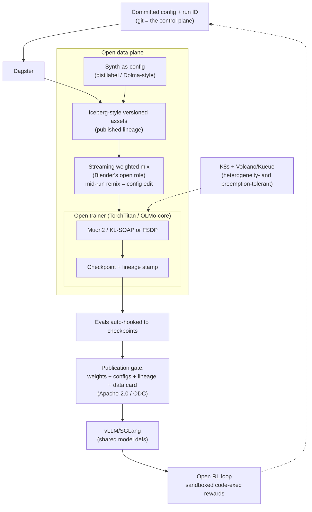

# Open Model Factory — Design Sketch

> Draft outline for an open-source, community-owned counterpart to the Poolside
> Model Factory (`method:poolside-model-factory`). The Poolside factory is the
> date-stamped process SOTA (Laguna M.1/XS.2, arXiv:2605.27605) but its
> internals are closed; this sketch defines what an open re-implementation
> looks like for labs that cannot use (or audit) a closed, owned stack.
>
> Status: **sketch, not SOTA.** Nothing here is benchmark-verified yet. This
> document is not a graph node; ingestion into `graph/` happens only after a
> public run demonstrates the claims below.

## 1. Positioning

The Poolside Model Factory is process SOTA but closed: named machines (Blender,
Titan, Atlas, Hive, AutoMixer, Saucer, Podium) are internal, and the stack is
now owned by Nvidia. The **Open Model Factory (OMF)** is the same problem —
make foundation-model development a repeatable, versioned process — with three
different constraints:

1. **Open end to end.** Every component must be open-source or open-specified.
   The *output* of the factory (configs, lineage graphs, data cards, weights)
   is as much a product as the weights themselves.
2. **Heterogeneous hardware.** Laguna ran on one homogeneous ~10k H200 fleet.
   An open factory must assume donor clusters, spot capacity, mixed
   vendor/network topologies, and preemption as the normal case.
3. **Small-lab first.** The scale-down path from `recipe:small-lab-model-factory`
   is the default path, not a degraded one. Cluster machinery is opt-in.

Train kernels do not change: Muon2 / KL-SOAP, OLMo-3 data recipe, CISPO/SAPO,
DeepSeek-V4/Kimi-K3 remain the library defaults. The factory is the shelf they
sit on.

## 2. Principles (carried over from Laguna §2, restated for open)

1. **Experiments as code, lineage by construction.** Every data, ablation, and
   train job is a committed config with a unique run ID. Assets live in a
   versioned lake; the lineage graph is *published*, so third parties can
   reproduce any checkpoint. This is the part this very library is a prototype
   of: knowledge about runs should be as open as weights.
2. **One research + production codebase.** Trainer and infer share model
   definitions (open: TorchTitan + vLLM/SGLang over shared model code), so a
   research win is a config flag, not a fork.
3. **Reserve human attention for novel decisions.** Recovery, retries, and
   consistency checks are automation work; on-call pages only on novel failure.

## 3. Component mapping (Poolside closed → open equivalent)

| Poolside machine | Role | Open equivalent | Maturity / gap |
| :--- | :--- | :--- | :--- |
| Dagster control plane | DAG, configs, run IDs | **Dagster** (already Apache-2.0) | Ready. No change. |
| Iceberg / Spark assets | Versioned table format + ingest | **Apache Iceberg + Spark/DuckDB**; small lab: Parquet + content-addressed store (lakeFS/DVC) | Ready |
| **Blender** | gRPC weighted streaming mix, mid-run remix, sidecar prefetch | Hugging Face `datatrove` / Dolma toolkit streaming, or the `stream_mix` recipe pattern | **Gap**: no open impl of *mid-run mix change with lineage intact*. Highest-value open contribution. |
| **Titan** (trainer) | Distributed train kernel | **TorchTitan** (public seed) or OLMo-core; distributed Muon from NVIDIA-NeMo/Emerging-Optimizers | Mostly ready; patch load is the cost |
| **Atlas** (infer) | vLLM-based serving sharing model defs | **vLLM / SGLang** consuming the same model defs | Ready |
| **Hive** synth | Declarative synthetic pipelines as config | **distilabel** / Dolma synth-style config; needs an open `SynthConfig` schema convention | Partial |
| **AutoMixer** | Proxy-swarm mix search | Skippable; open labs use small-proxy LR/data sweeps | Skip until cluster-scale |
| **Saucer / code-exec** | Sandboxed code exec for RL rewards, synth, evals | Self-hosted sandbox (Firecracker/gVisor/E2B-style), or per-lab CI runners | Partial; the 1M-repo scale is not needed |
| **Podium** | Dataset/model viewer, lab-wide vibe check | **Zeno** / Lantern-style viewers over the lake + W&B/MLflow | Partial |
| GPU↔GPU weight transfer | Trainer→infer NCCL P2P for online RL | verl/LMCache-style colocated or P2P weight sync in vLLM | Partial; skip until split-pool RL |
| FoundationDB scheduler | Per-job eviction, topology, placement | **Volcano / Kueue** on vanilla Kubernetes (single org); Slurm for donor HPC | Ready; do not build custom |

The named-machine pattern carries over (each component is a *role*), but every
role must be filled by an Apache/MIT-licensed implementation or a thin glue
layer over one.

## 4. Architecture (open)

Differences from the Poolside picture: the scheduler is off-the-shelf and must
tolerate preemption (no FoundationDB topology store); the lineage graph is a
published artifact, not an internal one; and promotion gates include license
and data-provenance checks, because openness is a release requirement.

## 5. Tiers

- **Tier 1 — single workstation / 1–8 GPUs.** Dagster or plain Python configs,
  content-addressed parquet, `stream_mix`, TorchTitan/OLMo-core, vLLM,
  eval-on-checkpoint. This is `recipe:small-lab-model-factory` as written.
- **Tier 2 — 8–512 GPUs, single org.** Add: Kubernetes + Volcano/Kueue,
  Iceberg catalog, checkpoint-level eval gating, open code-exec pool for RL.
  Still no AutoMixer, no custom scheduler.
- **Tier 3 — federated / community cluster (512+).** Multi-org contributor
  model: published lineage, preemption-tolerant scheduling, split
  trainer/infer pools with open P2P weight sync. This tier is where the open
  factory must *outperform* copying Poolside's stack, because nobody donates a
  homogeneous 10k-GPU pod.

## 6. Claims an open implementation would have to demonstrate

Before `method:open-model-factory` could take `status: sota` from the Poolside
method, it needs date-stamped, benchmark-grounded results:

1. **Cycle time**: committed-config → released Apache-2.0 checkpoint, measured
   (Poolside's baseline claim: five weeks, Laguna XS.2, cluster-scale).
2. **Lineage completeness**: any token/checkpoint/eval traces both ways.
3. **Promotion cost**: a research win lands as a config flag.
4. **Preemption survival**: training resumes across donor-cluster preemption
   without manual repair (the open-native requirement Poolside never had).

## 7. Gotchas

- Do not rename closed machines ("OpenTitan" collides with the silicon project;
  "OpenBlender" collides with Blender the 3D suite). Name roles, not clones.
- Do not let the factory task absorb the train-kernel defaults (same gotcha as
  the Poolside node: Laguna *ran* Muon/CISPO; it did not supersede them).
- Do not fork trainer and infer to "move faster": the shared-definitions
  property is the whole point.
- Mid-run remix is the one genuinely open engineering gap. Ship it before
  claiming feature parity.

## 8. Ingestion plan for the library (when this graduates)

1. `python -m library new method open-model-factory --title "Open Model Factory"` —
   `status: active`, `sota_for` empty (Poolside factory remains the measured
   process SOTA), `complements: method:poolside-model-factory`.
2. `python -m library new recipe open-factory-small-lab --title "Open Model Factory SOP"` —
   extends `recipe:small-lab-model-factory` with the component mapping table.
3. Update `graph/tasks/industrial-model-building.md` `methods:` list; leave
   `current_sota` pointing at `method:poolside-model-factory` until a public
   run reproduces the cycle-time claim.
4. `python -m library validate` — must pass with 0 errors.
